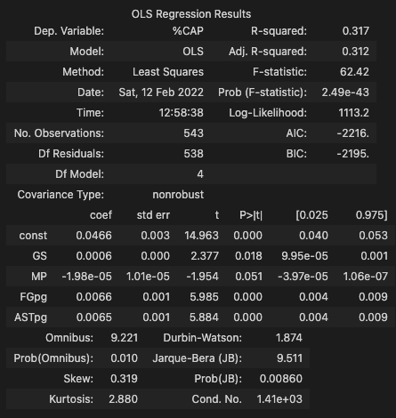
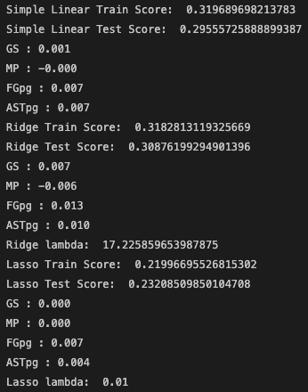

## MVP Overview

### Goal:
- To predict WNBA players salaries using season statistics to value players

### Scope: 
- 2016 - 2021 WNBA season stats and salaries

### Process:

- WNBA contracts can be multi-year deals so the average yearly salary was used which is calculated and readily available at Spotrac.com
- There can be fluctuations in salary as each year the maximum salary cap that a team can pay their player generally increases. So the target was calculated as salary/cap = %CAP. The WNBA did not enforce a maximum cap for 2016 and 2017 so a cap was assumed.
- Player stats columns which were variations of each other were dropped to create a final dataframe with 543 rows x 29 columns.

 

### Preliminary Results:

 

**StatsModels Summary**

- Started by running a regression on full data set and investigated the summary data. 
- Iterated until I reached an acceptable coefficient P-value and VIFs

 

**Model results**

- Ran a lasso regression on all 28 features in the dataframe and it assigned zero coefficient to all features except for FGpg and ASTpg which was also captured in the original Statsmodel summary
- Used 3 models with original 4 features to observe results 

### Further development:
- R-squared value is still quite low so try to increase this through further feature engineering
- Investigate interactions: maybe Games Started (GS) and Minutes Played (MP) may have an interaction. Intuitively if you are a starting player you would play more minutes
- Focus on a player and see what the predicted salary will be.