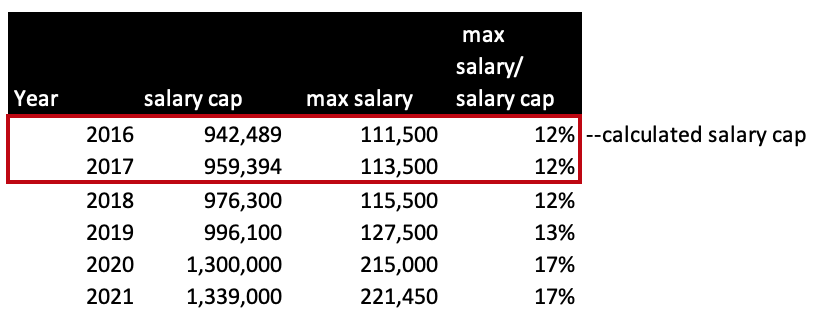
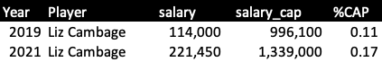
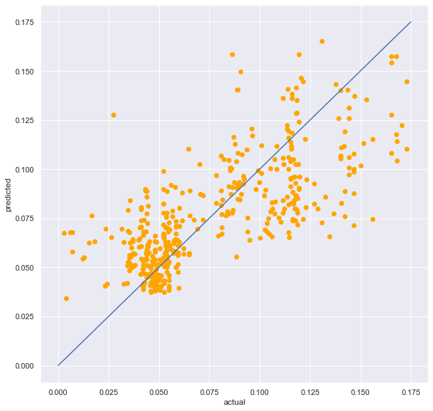
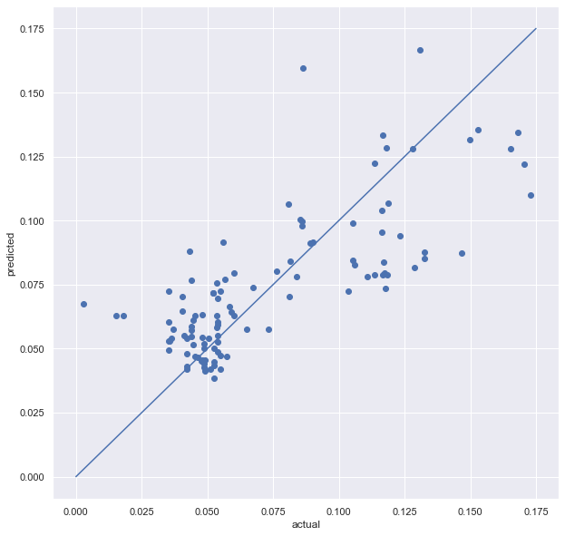

## Predicting WNBA Salaries

### Abstract:
The goal of this project was to predict Women's National Basketball Association (WNBA) players salaries and in turn their potential value in the league.
Data was acquired through webscraping including salary data and player statistics. A linear regression model was fitted on player statistics with salary as the target. Training and testing data sets created with KFolds used for cross validation. A lasso regression indicated that field goals per game (FGpg), assists per game (ASTpg) and years active were predictors of the salary target, and an interaction effect was observed, so an interaction term between FGpg and years active was added. A training R squared value of 0.54 and a test R-squared value of 0.59 was achieved with a mean absolute error (MAE) of 0.018.

### Design: 

WNBA contracts can be multi-year deals so the average yearly salary was used which is calculated and readily available at Spotrac.com.
In addition, salary has increased each year as the maximum salary cap that a team can pay their player generally increases year on year, so the yearly salary was normalized to reflect this. The WNBA did not enforce a maximum cap for 2016 and 2017 so a cap was calculated by applying the 2018 max salary/salary cap ratio of 12%. 

 
Below is a illustration of how the target was normalized and calculated as (player's average yearly salary)/(salary cap) = %CAP. 

 

 
The following section describes features collected in order to predict %CAP.

 

### Data:
WNBA data is limited compared to the NBA and salary data only going back to 2016 could be found on the Spotrac [website](https://www.spotrac.com/wnba/rankings/2021/base/). Salary data from 2016 to the most recently finished season 2021 was extracted using Selenium and player statistics were pulled for the same time period 2016 - 2021 seasons from basketball-reference.com for [Total Stats](https://www.basketball-reference.com/wnba/years/2021_totals.html), [Per Game Stats](https://www.basketball-reference.com/wnba/years/2021_per_game.html) and [Advanced Stats](https://www.basketball-reference.com/wnba/years/2021_advanced.html) using BeautifulSoup. Draft pick [data](https://www.wnba.com/all-time-wnba-draft-picks/) which includes draft year and pick order was added later in the process as regression results suggested that there may be missing features. The final dataframe consisted of 544 rows of data. 

 

### Algorithms:

<i> Feature Engineering </i>

1. 31 numerical features were used including overall game stats, per game stats, advanced stats taken from basketball-reference.com
2. A low initial r-squared score of 0.3 and non-normal residuals led to sourcing of alternative features such as: all-star awards, draft year, draft pick.
3. Years active was calculated from draft year to current year plus one e.g. if a player was drafted in 2021, in 2021 their years active would be 2021-2021+1 = 1 year active. If a player was drafted in 2011, in 2016 their years active would be 2016-2011+1 = 6 years active.
4. Lasso regression led to zeroing out of all feature coefficients except for FGpg, ASTpg and years active, which were kept for the final model. 
5. An interaction effect was observed between years active and FGpg so an additional interaction term ['FGpg x years active'] was added to the final model.

 
<i> Model Selection </i>

Simple Linear regression was initially used to fit the data using the 31 numerical features chosen above. Training score (0.59 r-squared) was consistently higher than the test data (0.55 r-squared) suggesting overfitting. Lasso was employed to zero out features that did not explain sufficient variance in the data, leaving in FGpg, ASTpg and years active. Polynomial and ridge regression models were discarded as they did not perform better than other models on r-squared scores and MAE and introduced unessecary model complexity with too many terms. Linear regression with an interaction term was chosen as the final model.

 

<i> Model Evaluation</i>

The entire dataset was split into 80/20 train vs test and training scores were calclulated with 5-fold cross validation within the 80% training set. Prediction on the 20% test dataset were completed at the very end and performed once. MAE was used to evaluate performance as it is robust to outliers and has ease of interpretability for stakeholders.

 

### Final results:

Linear Regression: 5-fold CV score: 0.56 +- 0.05

Final training r-squared score: 0.54

Final test r-squared score: 0.59

MAE: 0.018 (or $24,102 when converted to salary dollars for 2021)

Final linear regression equation : <b>%CAP =     0.0036 Yact
	    + 0.0031 FGpg 
	    + 0.0004 FGpg x Yact 
        + 0.0032 ASTpg
	    + 0.035 </b>

where Yact = Years Active, FGpg = Field Goals per game, ASTpg = Assists per game

 

**Linear Regression plot**
| Training dataset| Test dataset| 
| --------------- | --------------- | 
|| | 

 

### Tools:
- Selenium and Beautiful Soup for webscraping
- Pandas and NumPy for data manipulation  
- Matplotlib and Seaborn for plotting
- StatsModels and skLearn for linear regression